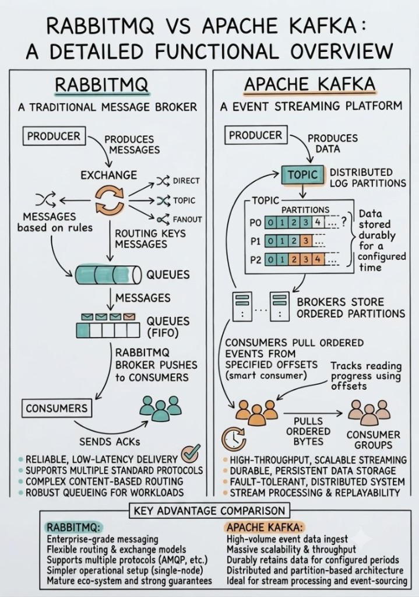

# RabbitMQ vs Apache Kafka: Which messaging tool is best for your architecture?

The choice depends on your specific needs, and understanding the differences between RabbitMQ and Apache Kafka is crucial. This diagram breaks down the fundamental distinctions in their operation:

## RabbitMQ: The Smart Broker, Dumb Consumer

- **Push Model:** RabbitMQ actively pushes messages to consumers, making it ideal for tasks that need immediate attention or processing.
- **Complex Routing:** Robust exchange mechanisms (Direct, Topic, Fanout) allow for granular message filtering and routing based on specific criteria.
- **Guaranteed Delivery:** Once a message is acknowledged, it's typically deleted, prioritizing reliable delivery over data retention.
- **Ideal for:** Workloads requiring real-time message processing, task queues, or complex routing logic.

## Apache Kafka: The Dumb Broker, Smart Consumer

- **Pull Model:** Consumers actively pull messages from Kafka topics, allowing them to process data at their own pace and handle backpressure effectively.
- **High Throughput & Distributed:** Its distributed log architecture enables Kafka to handle massive volumes of data with incredible speed.
- **Data Persistence & Replayability:** Kafka stores data for a configured period, allowing consumers to rewind and process historical data as needed.
- **Ideal for:** High-volume event streaming, data ingestion, real-time analytics, and scenarios requiring data replayability.

## Key Distinction

- **RabbitMQ** excels as a reliable, push-based messaging system with advanced routing.
- **Apache Kafka** shines as a high-performance, pull-based event streaming platform with durable storage.

The diagram above offers a clear visual comparison to help you choose the tool that best aligns with your system’s specific performance, reliability, and data handling requirements.

Este repositório foca em **Apache Kafka** como plataforma de event streaming (business events em `ride-hailing`, `banking` e `subscription`).
